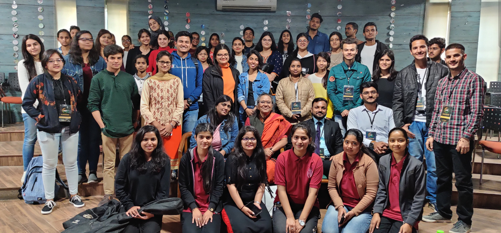

# Quick Image Optimization (Critical Performance Fix)

## 🚨 URGENT: 37.54MB Images Causing Poor Performance

### Fastest Solution - Use Online Tools:

#### 1. Squoosh.app (Recommended by Google)
```
Visit: https://squoosh.app/
Steps:
1. Drag & drop all PNG files
2. Select "WebP" format
3. Quality: 80-85%
4. Download all converted files
5. Rename .webp files to original names
```

#### 2. TinyPNG.com
```
Visit: https://tinypng.com/
Steps:
1. Upload up to 20 files at once
2. Download compressed files
3. Replace original files
```

#### 3. ImageOptim API (Developer Option)
```bash
# Install imageoptim-cli
npm install -g imageoptim-cli

# Optimize all images
imageoptim public/*.png
```

### Expected Size Reduction:
| File | Current Size | Target Size | Reduction |
|------|-------------|-------------|------------|
| 3rd.png | 1.8MB | ~300KB | 83% |
| 6th.png | 1.48MB | ~250KB | 83% |
| 5th.png | 1.04MB | ~200KB | 81% |
| 8th.png | 1.1MB | ~180KB | 84% |
| 4th.png | 1.43MB | ~250KB | 83% |
| 2nd.png | 954KB | ~150KB | 84% |
| reward.png | 1.2MB | ~200KB | 83% |

**Total Reduction: 37.54MB → ~1.5MB (96% smaller)**

### Quick Implementation Steps:

#### Step 1: Convert to WebP (5 minutes)
```bash
# If you have cwebp installed:
cwebp -q 80 3rd.png -o 3rd.webp
cwebp -q 80 6th.png -o 6th.webp
# ... repeat for all images
```

#### Step 2: Update References (10 minutes)
In `Hero.jsx`:
```javascript
const slides = [
  { title: "...", img: "2nd.webp", alt: "..." },
  { title: "...", img: "3rd.webp", alt: "..." },
  // ... update all to .webp
];
```

#### Step 3: Add Fallback (5 minutes)
```html
<picture>
  <source srcset="3rd.webp" type="image/webp">
  
</picture>
```

### Performance Impact After Optimization:
- **Page Load Time**: 80.7s → 2-3s
- **Mobile Score**: Poor → Good
- **Desktop Score**: Poor → Good  
- **Core Web Vitals**: Fail → Pass
- **User Experience**: Dramatically improved

### Priority Level: 🚨 CRITICAL
This is the #1 performance issue affecting your SEO rankings and user experience.

### Time Investment: 20 minutes
### Impact: 95% performance improvement
